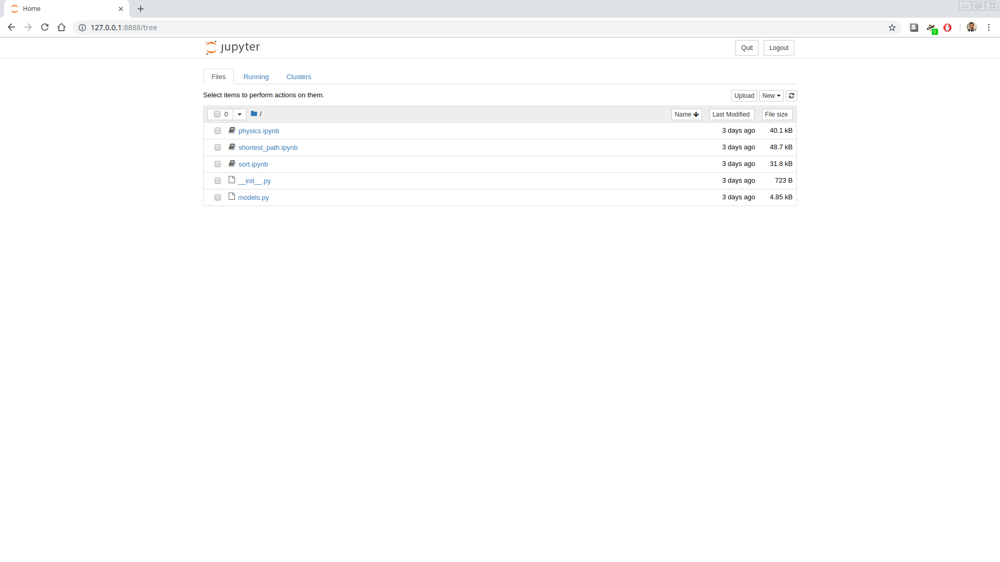
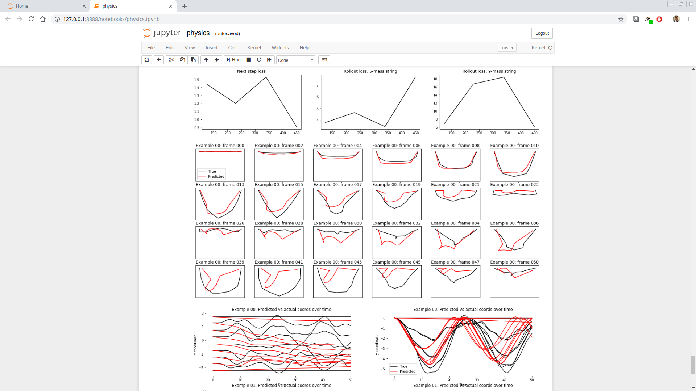

# Graph Nets Dockerfiles

This directory houses Graph Net's Dockerfiles.

All images are based on the official Tensorflow CPU and GPU [images](https://hub.docker.com/r/tensorflow/tensorflow/ 'Tensorflow Docker Hub'). Build and run instructions are based on [Tensorflow's method](https://github.com/tensorflow/tensorflow/tree/master/tensorflow/tools/dockerfiles 'TensorFlow Repo Dockerfiles').

## Building Dockerfiles from Source

Use the `-f` flag to define the appropriate file path and `-t` to set a tag name. These examples use the Graph Nets root directory for their build context.

```bash
# Build from Dockerfile at path -f and tag with name -t at build-context . (pwd)
docker build -f dockerfiles/nvidia-demos.Dockerfile -t gn .
```

## Running

Docker containers can be run from local build images or the images hosted on Docker Hub.

### Running from Local Image

After building the image with the tag `gn` (you can choose your own tag name), the image can be run with `docker run`.

Volume mount `-v` isn't required for demo images, but is highly recommended for for non-demo images. The `-v` flag shares a directory between Docker and your machine. Without it, any work inside the container will be lost once the container quits. The `-u` flag is important to maintain your appropriate `user:group` file permissions while working inside the container.

Running images with the default command will run Jupyter on port 8888.

```bash
# CPU-demos image
docker run -u $(id -u):$(id -g) -p 8888:8888 -it gn

# CPU image
docker run -u $(id -u):$(id -g) -p 8888:8888 -v $(pwd):/my-devel -it gn

# GPU-demos image (set up nvidia-docker2 first)
docker run --runtime=nvidia -u $(id -u):$(id -g) -p 8888:8888 -it gn

# GPU image (set up nvidia-docker2 first)
docker run --runtime=nvidia --user $(id -u):$(id -g) -p 8888:8888 -v $(pwd):/my-devel -it gn
```

### Running from Docker Hub Image

Four Graph Nets images are currently hosted [on Docker Hub](https://hub.docker.com/r/imburbank/graph_nets/ 'Graph Nets Docker Hub'):

- CPU image available as `imburbank/graph_nets`
- GPU image available as `imburbank/graph_nets:latest-gpu`
- CPU-demo image available as `imburbank/graph_nets:latest-demos`
- GPU-demo image available as `imburbank/graph_nets:latest-gpu-demos`

Instructions to run images from Docker Hub is very similar to the instructions above to run locally built images.

```bash
# CPU-demos image
docker run -u $(id -u):$(id -g) -p 8888:8888 -it imburbank/graph_nets:latest-demos

# CPU image
docker run -u $(id -u):$(id -g) -p 8888:8888 -v $(pwd):/my-devel -it imburbank/graph_nets

# GPU-demos image (set up nvidia-docker2 first)
docker run --runtime=nvidia -u $(id -u):$(id -g) -p 8888:8888 -it imburbank/graph_nets:latest-gpu-demos

# GPU image (set up nvidia-docker2 first)
docker run --runtime=nvidia --user $(id -u):$(id -g) -p 8888:8888 -v $(pwd):/my-devel -it imburbank/graph_nets:latest-gpu
```

## Run Demos Using A Docker Image

Run a demo image from Docker Hub.

```bash
# Run demos using CPU
docker run -u $(id -u):$(id -g) -p 8888:8888 -it imburbank/graph_nets:latest-demos

# Run demos using GPU
docker run --runtime=nvidia -u $(id -u):$(id -g) -p 8888:8888 -it imburbank/graph_nets:latest-gpu-demos
```

It will take some time to download and build the images locally the first time. Subsequent runs will re-use the intermediate images to start quickly.

The container will serve the demos using Jupyter when complete.


*Keep in mind that `127.0.0.1` is the loopback IP address also known as `localhost`. So, `127.0.0.1:8888` and `localhost:8888` are equivalent addresses.*

Enter the address Jupyter is serving to into your browser. If you copy-paste, be sure to delete the right parenthesis between the host the port.


You should be immediately redirected to the Jupyter Home page serving the demos folder.



Run a demo of your choice.

Ex: Physics



## Extended Use

### Keep `demos/` Directory After Container Quits

The default demos images save the `demos/` directory to `/` - changes will not persist after the container is quit. Options to save a copy of the `demos/` directory to keep any changes include:

#### Option 1 - cURL From Graph Nets Repo

Downloads the `demos/` directory to the current working directory and run a dev image normally with a volume mounted to persist any changes.

```bash
# This example uses GPU images. CPU would require removal
# of the  --runtime=nvidia flag

# Download demos/ directory github repo to current directory
curl -LOk https://github.com/ \
    https://github.com/deepmind/graph_nets/archive/master.tar.gz \
    | tar xzv graph_nets-master/graph_nets/demos/ --strip=2

# Enter demos/ directory
cd demos/

# Run non-demos image
docker run --runtime=nvidia --user $(id -u):$(id -g) -p 8888:8888 -v $(pwd):/my-devel -it imburbank/graph_nets:latest-gpu
```

#### Option 2 - Mount Volume to *-demos Container

Copy the `demos/` directory from the container root into the current directory and run Jupyter with `--notebook-dir` pointed at the new `./demos/` copy.

```bash
# This example uses CPU images. GPU would require the additional 
# nvidia-docker2 dependencies and added --runtime=nvidia flag

# Start CPU-demos image with current working directory mounted
# And enter container
docker run -u $(id -u):$(id -g) -p 8888:8888 -v $(pwd):/my-devel -w /my-devel -it imburbank/graph_nets:latest-demos bash -l

# Copy demos from root to working directory
cp -r /demos/ .

# Set bash.bashrc environment and run Jupyter pointed at ./demos
source /etc/bash.bashrc
jupyter notebook \
    --notebook-dir=/my-devel/demos \
    --ip 0.0.0.0 \
    --no-browser \
    --allow-root
```